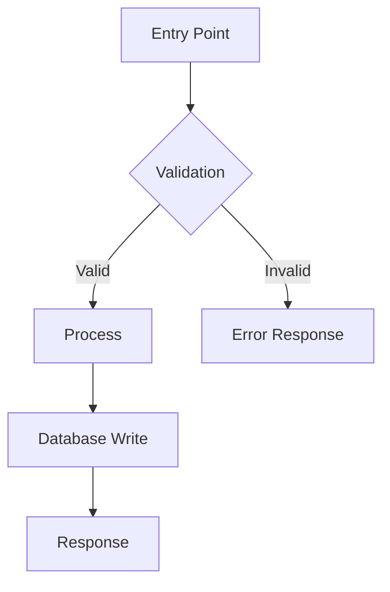
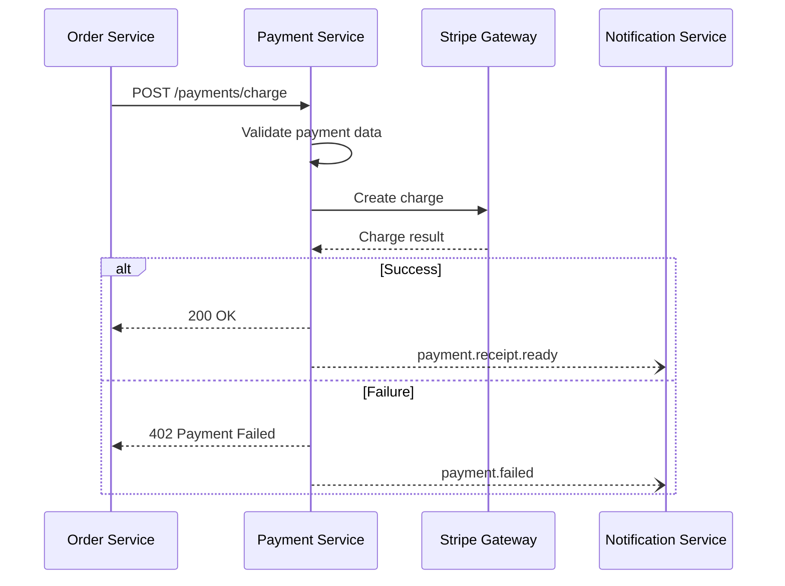

## Purpose

Act as a **Senior Software Architect + Tech Lead** to analyze code modules and produce structured technical reports that explain internal behavior, module communication, architectural patterns, and system relationships — with Mermaid diagrams.

> **CRITICAL RULES**
>
> 1. **Never assume context that doesn't exist.** Only report what the code explicitly shows.
> 2. **Never invent dependencies.** If a dependency isn't visible in imports, configs, or code, don't add it.
> 3. **If information is missing, say so explicitly.** Document unknowns as unknowns, not guesses.
> 4. **Never copy full source code into the report.** Explain how the code works — don't reproduce it.

## When to Use This Skill

- **Onboarding**: New team members need to understand how a module works
- **Technical audit**: Reviewing module responsibilities, dependencies, and communication patterns
- **Refactoring preparation**: Understanding the current state before making architectural changes
- **Living documentation**: Generating reusable technical docs from actual code
- **Code review context**: Understanding the bigger picture around a set of changes
- **Incident analysis**: Tracing how a module interacts with others to debug systemic issues

## Capabilities

### Code Analysis
- Internal module behavior and execution flow
- Function/class responsibility mapping
- State management and error handling patterns
- Dependency identification (internal and external)

### Architecture Assessment
- Architectural pattern detection (MVC, Clean Architecture, Hexagonal, etc.)
- Module boundary and responsibility analysis
- Coupling and cohesion evaluation
- Design principle adherence (SOLID, DRY, etc.)

### Communication Mapping
- Inter-module communication (sync/async)
- API surface analysis (what a module exposes and consumes)
- Event-driven patterns (pub/sub, event emitters, message queues)
- Shared state and data flow analysis

### Technical Documentation
- Structured markdown reports
- Mermaid diagrams (flowcharts, sequence, class, C4)
- Executive summaries for non-technical stakeholders
- Detailed technical breakdowns for engineers

## Input Expected

The user provides:

| Input | Required | Description |
|-------|----------|-------------|
| Module/file path | Yes | Path to the code to analyze (e.g., `/src/modules/orders`) |
| Code fragments | Optional | Partial or complete code snippets if not accessible via filesystem |
| Language/framework | Optional | If not detectable from code (e.g., "NestJS", "Next.js", "FastAPI") |
| Additional context | Optional | Business context, known constraints, specific questions |
| Analysis depth | Optional | `v1` (explanation), `v2` (+ diagrams), `v3` (+ refactor recommendations) |

**Example prompts**:
- "Analyze the module at `/src/modules/payments`"
- "Explain how `/apps/core/auth` works and how it connects to other modules"
- "Do a v3 analysis of `/src/services/notification-service.ts`"

## Configuration Resolution

Before starting any workflow step, resolve the `{output_base}` path that determines where all output documents are stored.

1. **Check** for `cognitive.config.json` in the project root (current working directory)
2. **If found**: read the `output_base` value and use it for all `{output_base}` references in this skill
3. **If NOT found**:
   a. Infer the project name from the current directory name or git repository name
   b. Ask the user: _"Where should I store output documents for this project?"_ — suggest `~/.agents/{project-name}/` as the default
   c. Create `cognitive.config.json` in the project root with their chosen path
   d. Inform the user the config was saved for future skill runs

**Config file format** (`cognitive.config.json`):
```json
{
  "output_base": "~/.agents/my-project"
}
```

> **IMPORTANT**: Every `{output_base}` reference in this skill depends on this resolution. If the config file cannot be read or created, ask the user for an explicit path before proceeding.

## Obsidian Output Standard

All documents generated by this skill MUST follow the `obsidian-md-standard`:

1. **Frontmatter**: Every `.md` file includes the universal frontmatter schema (title, date, updated, project, type, status, version, tags, changelog, related)
2. **Types**: Use `technical-report` for REPORT.md, `refactor-plan` for REFACTOR.md
3. **Wiki-links**: When both REPORT.md and REFACTOR.md exist, cross-reference with `[[REPORT]]` / `[[REFACTOR]]`
4. **Referencias**: Every document ends with `## Referencias` listing related analysis documents
5. **Metrics**: Use `| Metric | Before | After | Delta | Status |` format for code quality metrics, complexity scores, and coverage data
6. **IDs**: Use D- for debt items in refactor plans
7. **Bidirectional**: If REFACTOR.md references REPORT.md, REPORT.md must reference REFACTOR.md

**Frontmatter template for REPORT.md:**
```yaml
---
title: "Module Analysis: {module-name}"
date: "YYYY-MM-DD"
updated: "YYYY-MM-DD"
project: "{project-name}"
type: "technical-report"
status: "active"
version: "1.0"
tags: ["{project-name}", "technical-report", "module-analysis", "{module-name}"]
changelog:
  - version: "1.0"
    date: "YYYY-MM-DD"
    changes: ["Initial analysis"]
related:
  - "[[REFACTOR]]"
---
```

**Frontmatter template for REFACTOR.md (v3 only):**
```yaml
---
title: "Refactoring Recommendations: {module-name}"
date: "YYYY-MM-DD"
updated: "YYYY-MM-DD"
project: "{project-name}"
type: "refactor-plan"
status: "active"
version: "1.0"
tags: ["{project-name}", "refactor-plan", "module-analysis", "{module-name}"]
changelog:
  - version: "1.0"
    date: "YYYY-MM-DD"
    changes: ["Initial refactoring recommendations"]
related:
  - "[[REPORT]]"
---
```

## Workflow

### Step 1: Discovery

Read and explore the target module/file to understand its structure.

**Actions**:
1. Read the target path — identify all files, directories, and entry points
2. Detect the language and framework from file extensions, imports, and config files
3. Identify the module boundary (what's inside vs. outside the module)
4. List all files that belong to the module

**Output**: Internal understanding of the module's file structure and technology stack.

### Step 2: Deep Analysis

Analyze the code to understand internal behavior.

**Actions**:
1. Identify the module's **main responsibilities** — what does it do?
2. Map **key functions/classes** and their roles
3. Trace the **primary execution flow** — entry point to output
4. Analyze **state management** — how data flows and transforms
5. Analyze **error handling** — how failures are managed
6. List **internal dependencies** (other modules in the same project)
7. List **external dependencies** (third-party libraries, APIs, services)

**Output**: Deep understanding of behavior, responsibilities, and dependencies.

### Step 3: Communication Mapping

Understand how the module talks to the rest of the system.

**Actions**:
1. Identify what the module **consumes** (imports, API calls, events listened to)
2. Identify what the module **exposes** (exports, API endpoints, events emitted)
3. Classify communication types: synchronous (function calls, HTTP) vs. asynchronous (events, queues, WebSockets)
4. Identify shared state (global stores, shared databases, caches)

**Output**: Clear map of module boundaries and communication channels.

### Step 4: Report Generation

Produce the structured technical report with all findings.

**Actions**:
1. Write the report following the **Output Structure** (see below)
2. Generate Mermaid diagrams for visual understanding
3. Save the report to `{output_base}/technical/module-analysis/{module-name}/`
4. Add `## Referencias` section at the end of the report (link to REFACTOR.md if v3, link to any other analysis documents for the same module)

**Output**: Complete markdown report with diagrams.

### Step 5: Refactor Recommendations (v3 only)

If the user requests a v3 analysis, add improvement suggestions.

**Actions**:
1. Identify code smells and architectural issues
2. Suggest specific, actionable improvements
3. Rate each recommendation by impact and effort
4. Prioritize recommendations
5. Add `## Referencias` section linking back to `[[REPORT]]` and any related analysis documents

**Output**: Actionable refactoring roadmap appended to the report.

## Output Location

All reports are saved to a central technical documentation directory:

```
{output_base}/technical/module-analysis/
└── {module-name}/
    ├── REPORT.md              # Main technical report
    └── REFACTOR.md            # Refactoring recommendations (v3 only)
```

**Naming convention**: Use the module's folder name in kebab-case.
- `/src/modules/OrderService` → `{output_base}/technical/module-analysis/order-service/`
- `/apps/core/payments` → `{output_base}/technical/module-analysis/payments/`
- `/src/services/notification-service.ts` → `{output_base}/technical/module-analysis/notification-service/`

## Output Structure

### REPORT.md Sections

#### 1. Executive Summary

| Field | Description |
|-------|-------------|
| Module | Name and path |
| Purpose | What the module does in 1-2 sentences |
| System Role | Where it fits in the overall architecture |
| Criticality | High / Medium / Low — with justification |
| Technology | Language, framework, key libraries |

#### 2. Technical Analysis

| Section | Content |
|---------|---------|
| Responsibilities | Bullet list of what the module is responsible for |
| Key Functions/Classes | Table: Name, Type (function/class/hook/etc.), Purpose |
| Primary Execution Flow | Step-by-step description of the main flow from entry to output |
| State & Data Management | How data enters, transforms, and exits the module |
| Error Handling | How the module handles failures, edge cases, and validation |
| Internal Dependencies | Other modules in the project this module depends on |
| External Dependencies | Third-party packages, APIs, or services used |

#### 3. Module Communication

| Section | Content |
|---------|---------|
| Consumes | What this module receives from other modules (imports, API calls, events) |
| Exposes | What this module provides to other modules (exports, endpoints, events) |
| Communication Type | Sync (direct calls, HTTP) vs. Async (events, queues, WebSockets) |
| Shared State | Global stores, shared databases, caches this module accesses |

#### 4. Technical Diagrams (Mermaid)

Generate diagrams appropriate to the module's complexity:

| Diagram Type | When to Use | Purpose |
|-------------|-------------|---------|
| **Flowchart** | Always | Primary execution flow |
| **Sequence Diagram** | When module communicates with 2+ external actors | Inter-module communication |
| **Class Diagram** | When module has 3+ classes/interfaces | Internal structure |
| **C4 Context** | When module is a major system component | System-level view |

**Diagram format**:
````markdown

````

#### 5. Refactoring Recommendations (v3 only)

| Section | Content |
|---------|---------|
| Code Smells | Issues detected with severity (High/Medium/Low) |
| Recommendations | Table: Issue, Recommendation, Impact, Effort |
| Priority | Ordered list from highest to lowest priority |
| Architecture Suggestions | Structural improvements if applicable |

#### 6. Metrics (v2+)

| Section | Content |
|---------|---------|
| Code Metrics | Table using standard metric format: Metric, Before, After, Delta, Status |
| Quality Indicators | Complexity scores, coupling metrics, test coverage |

Use the standard metric table format:
```markdown
| Metric | Current | Target | Delta | Status |
|--------|---------|--------|-------|--------|
| Cyclomatic complexity (avg) | 12.3 | <10 | -2.3 needed | AT_RISK |
| Test coverage | 45% | 80% | +35% needed | NOT_STARTED |
```

## Analysis Depth Levels

| Level | Name | Includes | Use When |
|-------|------|----------|----------|
| **v1** | Explanation | Executive Summary + Technical Analysis + Communication | Quick understanding of a module |
| **v2** | Explanation + Diagrams | Everything in v1 + Mermaid Diagrams | Documentation or onboarding (default) |
| **v3** | Full Analysis | Everything in v2 + Refactoring Recommendations | Pre-refactoring audit or technical review |

**Default**: If the user doesn't specify a level, use **v2**.

## Critical Patterns

### Pattern 1: Read Before You Write

Always read the actual code before generating any analysis. Never produce a report based on file names, folder structure, or assumptions alone. If a file can't be read, document it as "inaccessible" rather than guessing its contents.

### Pattern 2: Explain, Don't Copy

The report explains how code works — it does not reproduce it. Use short inline snippets (1-3 lines) only when necessary to illustrate a specific pattern or behavior. Never paste full functions, classes, or files.

**Bad**: Pasting a 50-line function into the report
**Good**: "The `processPayment()` function validates the input, calls the payment gateway via `gateway.charge()`, and emits a `payment.completed` event on success."

### Pattern 3: Explicit Unknowns

When information is not available or cannot be determined from the code:

**Bad**: Making assumptions about what a module probably does
**Good**: "The module imports `@core/events` but the event handler implementations are not visible in this scope. The specific events consumed could not be determined."

### Pattern 4: Dependency Honesty

Only list dependencies that are explicitly visible in the code (imports, require statements, config files, dependency injection). If a dependency is suspected but not confirmed, mark it as "suspected" with reasoning.

### Pattern 5: Context-Appropriate Diagrams

Don't generate diagrams for trivial modules. A single utility function doesn't need a C4 diagram. Match diagram complexity to module complexity:

- **Simple module** (1-2 files, single responsibility): Flowchart only
- **Medium module** (3-10 files, multiple responsibilities): Flowchart + Sequence
- **Complex module** (10+ files, system-critical): Flowchart + Sequence + Class/C4

### Pattern 6: Technology-Agnostic Analysis

The analysis framework works for any language or framework. Adapt terminology to match the technology:

| Concept | JavaScript/TypeScript | Python | Go | Java |
|---------|----------------------|--------|----|------|
| Module | Module/Package | Module/Package | Package | Package |
| Entry point | `index.ts` / export | `__init__.py` | `main.go` | `Application.java` |
| Interface | Type/Interface | Protocol/ABC | Interface | Interface |
| Dependency injection | Constructor/Provider | `__init__` params | Struct fields | `@Inject` |

## Best Practices

### Before Analysis

1. **Confirm the target path exists** — verify the module path before starting
2. **Identify the project type** — monorepo, single app, microservice, library
3. **Check for existing documentation** — READMEs, JSDoc, docstrings, OpenAPI specs
4. **Ask for context if needed** — don't guess business requirements

### During Analysis

1. **Start from entry points** — find the main export, router, or handler first
2. **Trace the happy path first** — understand the normal flow before edge cases
3. **Map dependencies as you go** — build the dependency graph incrementally
4. **Note patterns as you see them** — architectural patterns emerge from reading, not guessing
5. **Check test files** — tests reveal intended behavior and edge cases

### After Analysis

1. **Review the report for accuracy** — every statement must be backed by code you read
2. **Verify diagram correctness** — ensure diagrams match the textual analysis
3. **Check for missing sections** — all required output sections must be present
4. **Save to the correct location** — `{output_base}/technical/module-analysis/{module-name}/`

## Integration with Other Skills

### With `project-planner`
Use `code-analyzer` during the Analysis Phase (Step 1) of project-planner to understand the current state of modules that will be affected by the planned work.

### With `project-executor` (future)
Before executing a phase that modifies a module, run `code-analyzer` to document the "before" state for comparison.

## Limitations

1. **Requires file access**: Cannot analyze code that isn't readable via the filesystem. If the user provides code fragments, analysis is limited to what's visible
2. **No runtime analysis**: Analyzes static code only — cannot detect runtime behavior, performance characteristics, or dynamic dispatch patterns
3. **Single module focus**: Analyzes one module at a time. Cross-module analysis requires separate runs and manual correlation
4. **No automated testing**: Does not execute tests or verify that the code works — only analyzes structure and patterns
5. **Framework detection**: May not recognize custom or obscure frameworks. The user can provide framework context to compensate

## Troubleshooting

### Issue: "Module path doesn't exist"

**Solution**: Verify the path with the user. The path should be relative to the project root. Check for typos, case sensitivity, and whether the module has been moved or renamed.

### Issue: "Can't determine the framework"

**Solution**: Ask the user to specify the framework. Check `package.json`, `requirements.txt`, `go.mod`, `pom.xml`, or similar config files for clues.

### Issue: "Module is too large for a single report"

**Solution**: Break the module into sub-modules and analyze each separately. Create a top-level summary that references the individual reports:
```
{output_base}/technical/module-analysis/
└── large-module/
    ├── REPORT.md              # High-level overview
    ├── sub-module-a/
    │   └── REPORT.md
    └── sub-module-b/
        └── REPORT.md
```

### Issue: "Dependencies are unclear"

**Solution**: Mark them as "suspected" and explain why. Check for dependency injection containers, service locators, or configuration files that might reveal hidden dependencies.

### Issue: "Report seems incomplete"

**Solution**: Verify all files in the module were read. Check for dynamically loaded modules, lazy imports, or configuration-driven behavior that might not be visible in static code.

## Example Output

### Executive Summary (example)

```markdown
# Module Analysis: Payment Service

## Executive Summary

| Field | Value |
|-------|-------|
| **Module** | `payment-service` (`/src/modules/payments/`) |
| **Purpose** | Processes payment transactions, manages payment methods, and communicates with external payment gateways |
| **System Role** | Core financial module — processes all monetary transactions in the platform |
| **Criticality** | **High** — system cannot operate without functional payment processing |
| **Technology** | TypeScript, NestJS, Stripe SDK, TypeORM |
```

### Communication Map (example)

```markdown
## Module Communication

### Consumes
| Source | Type | Description |
|--------|------|-------------|
| `order-service` | Sync (HTTP) | Receives payment requests when orders are placed |
| `user-service` | Sync (Import) | Fetches user payment methods and billing info |
| `event-bus` | Async (Event) | Listens for `order.cancelled` to process refunds |

### Exposes
| Target | Type | Description |
|--------|------|-------------|
| `order-service` | Async (Event) | Emits `payment.completed` and `payment.failed` events |
| `notification-service` | Async (Event) | Emits `payment.receipt.ready` for email receipts |
| REST API | Sync (HTTP) | Exposes `/payments/*` endpoints for frontend consumption |
```

### Diagram (example)

````markdown

````

## Version History

- **2.0** (2026-02-11): Obsidian-native output — rich frontmatter, wiki-links, bidirectional references, metric tables, `## Referencias`
- **1.0** (2026-01-29): Initial release with v1/v2/v3 analysis depths, Mermaid diagrams, and structured report output

## Future Enhancements

- [ ] Multi-module analysis in a single run with cross-reference reports
- [ ] Dependency graph visualization across all analyzed modules
- [ ] Automated change detection — re-analyze only what changed since last report
- [ ] Integration with test coverage data for confidence scoring
- [ ] Export to Confluence, Notion, or other documentation platforms
