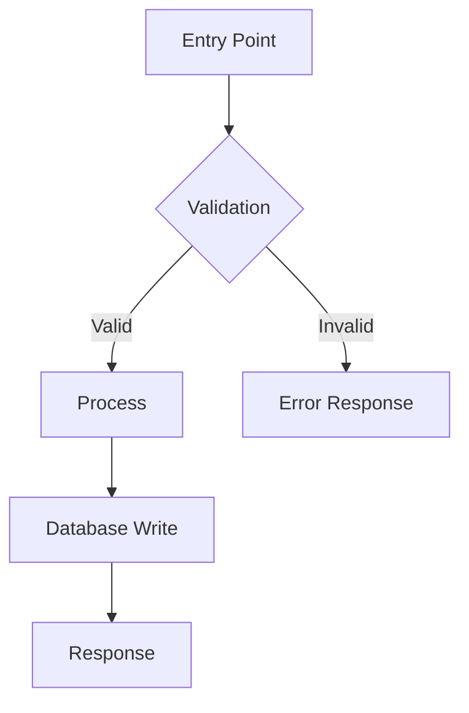
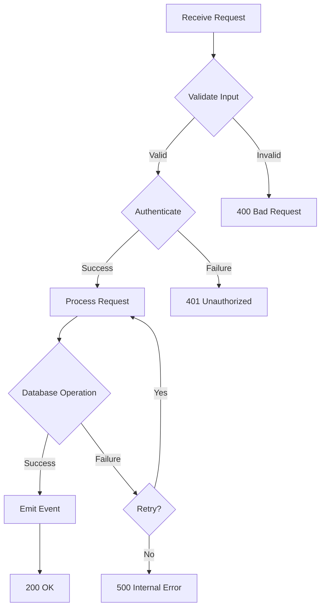
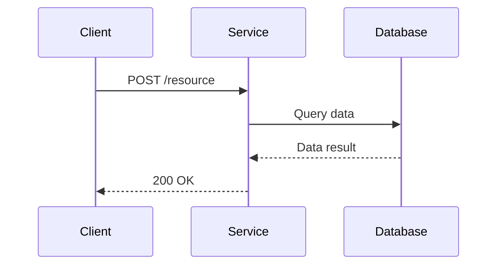
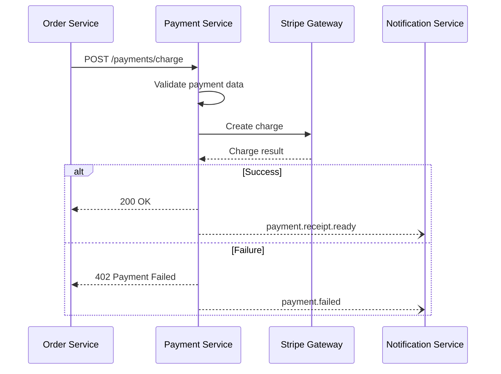
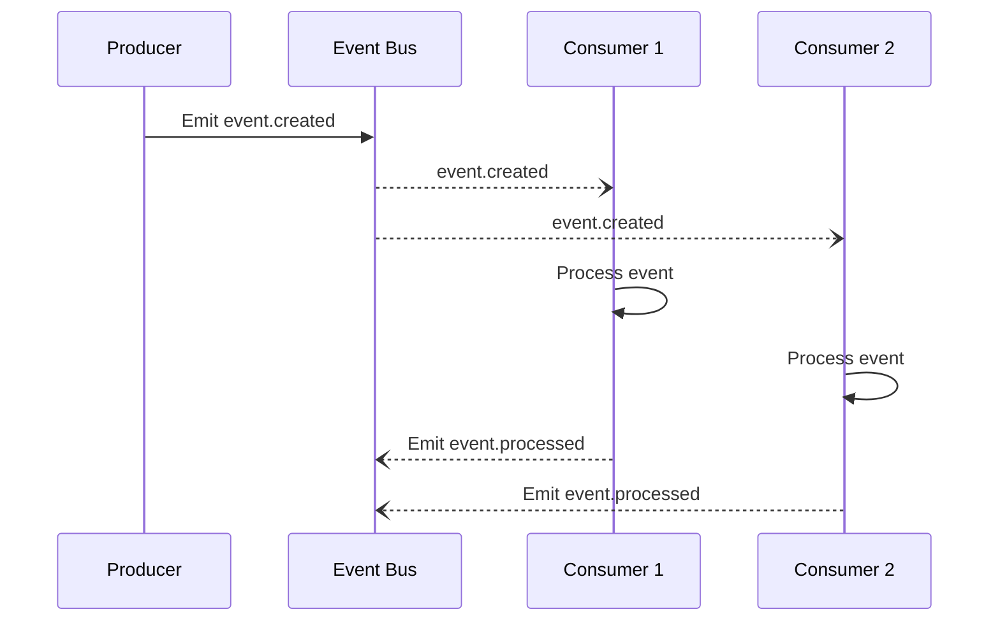
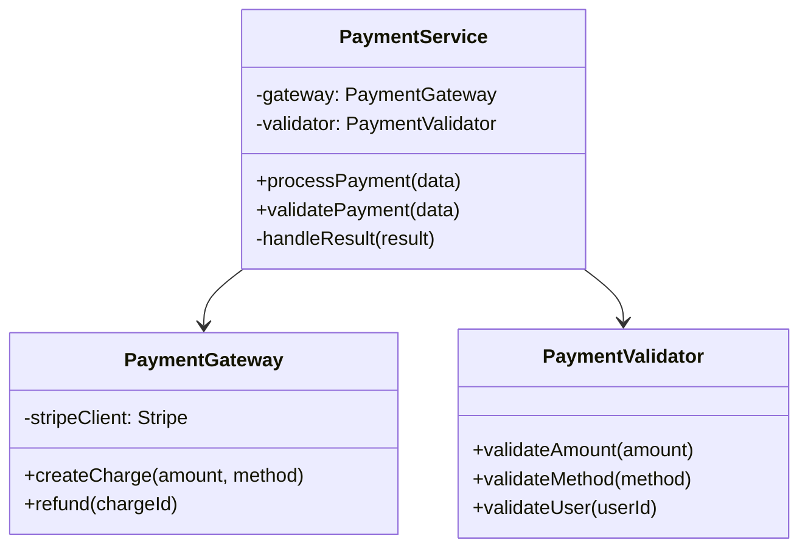
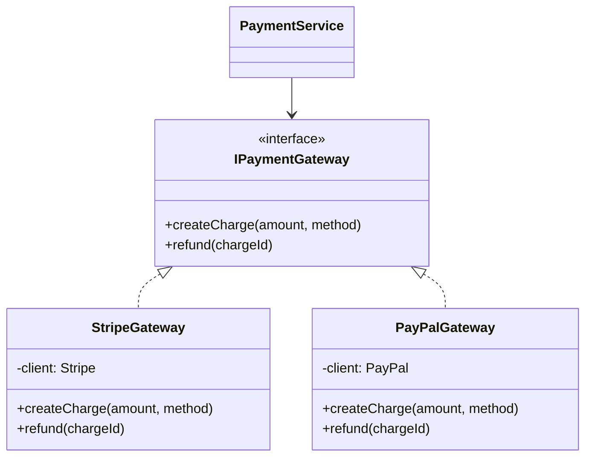
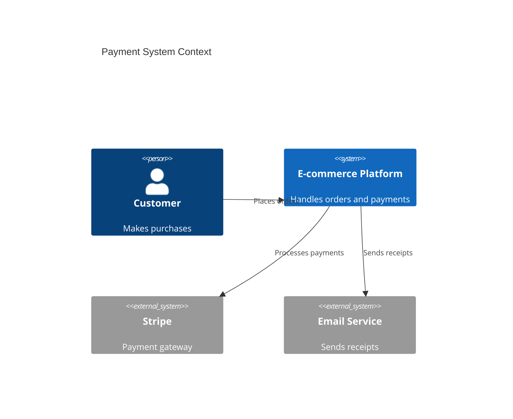

# Diagram Guidelines

Guidelines for selecting and generating Mermaid diagrams in code-analyzer reports.

## Diagram Type Selection

| Diagram Type | When to Use | Purpose |
|-------------|-------------|---------|
| **Flowchart** | Always | Visualize primary execution flow through the module |
| **Sequence Diagram** | When module communicates with 2+ external actors | Show inter-module communication and message flow |
| **Class Diagram** | When module has 3+ classes/interfaces | Display internal structure and relationships |
| **C4 Context** | When module is a major system component | Provide system-level view of module's role |

## Complexity-Based Guidelines

Don't generate diagrams for trivial modules. Match diagram complexity to module complexity:

- **Simple module** (1-2 files, single responsibility): Flowchart only
- **Medium module** (3-10 files, multiple responsibilities): Flowchart + Sequence
- **Complex module** (10+ files, system-critical): Flowchart + Sequence + Class/C4

## Flowchart Examples

### Basic Execution Flow

````markdown

````

### Complex Flow with Error Handling

````markdown

````

## Sequence Diagram Examples

### Simple Service Communication

````markdown

````

### Multi-Service Interaction

````markdown

````

### Event-Driven Communication

````markdown

````

## Class Diagram Examples

### Basic Class Structure

````markdown

````

### Inheritance and Interfaces

````markdown

````

## C4 Context Diagram

Use for system-level views of major components.

````markdown

````

## Best Practices

### Do:
- Use clear, descriptive labels for nodes and relationships
- Show the happy path prominently
- Include error handling flows for critical operations
- Use consistent naming conventions across diagrams
- Keep diagrams focused on one aspect (flow, communication, structure)

### Don't:
- Include implementation details (variable names, exact syntax)
- Make diagrams too complex (>15 nodes in a flowchart, >8 actors in sequence)
- Duplicate information across multiple diagrams
- Show trivial flows that don't add understanding
- Use diagrams when prose is clearer

## Diagram Format

Always wrap Mermaid diagrams in code blocks:

````markdown
```mermaid
[diagram content]
```
````

## Accessibility

Add brief text descriptions before complex diagrams:

```markdown
The following sequence diagram shows the payment processing flow when an order is placed. The order service initiates the payment, the payment service validates and processes via Stripe, and the notification service is triggered on completion.

```mermaid
[sequence diagram]
```
```

## Testing Diagrams

Before including a diagram:
1. Verify syntax is correct (Mermaid will render it)
2. Check that it matches the textual analysis
3. Ensure it adds value (not just decoration)
4. Confirm it's readable at typical document widths
