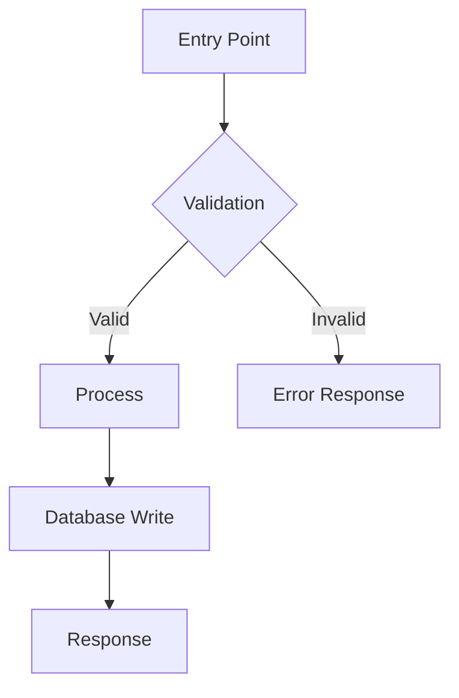
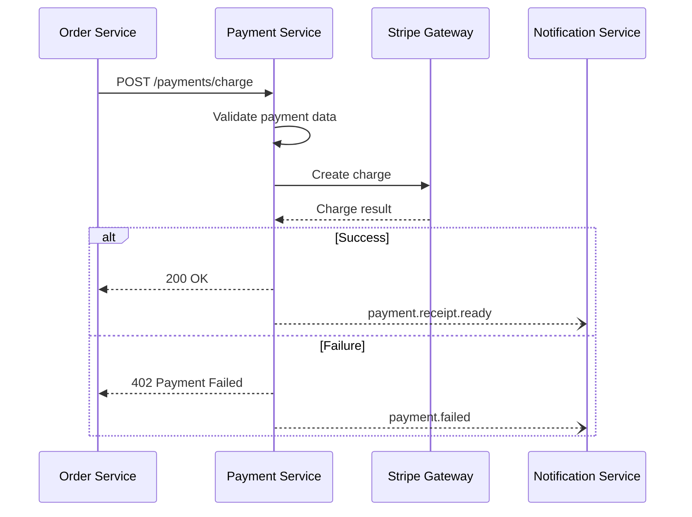

# REPORT.md Template

Complete technical analysis report structure for code-analyzer v2+.

## Frontmatter Schema

```yaml
---
title: "Module Analysis: {{module-name}}"
date: "{{YYYY-MM-DD}}"
updated: "{{YYYY-MM-DD}}"
project: "{{project-name}}"
type: "technical-report"
status: "active"
version: "1.0"
tags: ["{{project-name}}", "technical-report", "module-analysis", "{{module-name}}"]
changelog:
  - version: "1.0"
    date: "{{YYYY-MM-DD}}"
    changes: ["Initial analysis"]
related:
  - "[[REFACTOR]]"  # Only if v3 analysis includes REFACTOR.md
---
```

## Document Structure

### 1. Executive Summary

| Field | Description |
|-------|-------------|
| Module | Name and path |
| Purpose | What the module does in 1-2 sentences |
| System Role | Where it fits in the overall architecture |
| Criticality | High / Medium / Low — with justification |
| Technology | Language, framework, key libraries |

**Example:**

```markdown
## Executive Summary

| Field | Value |
|-------|-------|
| **Module** | `payment-service` (`/src/modules/payments/`) |
| **Purpose** | Processes payment transactions, manages payment methods, and communicates with external payment gateways |
| **System Role** | Core financial module — processes all monetary transactions in the platform |
| **Criticality** | **High** — system cannot operate without functional payment processing |
| **Technology** | TypeScript, NestJS, Stripe SDK, TypeORM |
```

### 2. Technical Analysis

| Section | Content |
|---------|---------|
| Responsibilities | Bullet list of what the module is responsible for |
| Key Functions/Classes | Table: Name, Type (function/class/hook/etc.), Purpose |
| Primary Execution Flow | Step-by-step description of the main flow from entry to output |
| State & Data Management | How data enters, transforms, and exits the module |
| Error Handling | How the module handles failures, edge cases, and validation |
| Internal Dependencies | Other modules in the project this module depends on |
| External Dependencies | Third-party packages, APIs, or services used |

**Example:**

```markdown
## Technical Analysis

### Responsibilities
- Process payment transactions for all order types
- Manage user payment methods and billing information
- Communicate with external payment gateway (Stripe)
- Handle payment retries and failure scenarios
- Emit payment events for downstream services

### Key Functions/Classes

| Name | Type | Purpose |
|------|------|---------|
| `PaymentService` | Class | Core service orchestrating payment operations |
| `processPayment()` | Method | Main entry point for payment processing |
| `validatePaymentData()` | Method | Validates payment request data |
| `createStripeCharge()` | Method | Interfaces with Stripe SDK |

### Primary Execution Flow

1. Receive payment request from order-service
2. Validate payment data (amount, payment method, user)
3. Fetch user payment method from database
4. Create charge via Stripe SDK
5. Handle response (success/failure)
6. Update database with transaction record
7. Emit appropriate event (`payment.completed` or `payment.failed`)
8. Return result to caller
```

### 3. Module Communication

| Section | Content |
|---------|---------|
| Consumes | What this module receives from other modules (imports, API calls, events) |
| Exposes | What this module provides to other modules (exports, endpoints, events) |
| Communication Type | Sync (direct calls, HTTP) vs. Async (events, queues, WebSockets) |
| Shared State | Global stores, shared databases, caches this module accesses |

**Example:**

```markdown
## Module Communication

### Consumes
| Source | Type | Description |
|--------|------|-------------|
| `order-service` | Sync (HTTP) | Receives payment requests when orders are placed |
| `user-service` | Sync (Import) | Fetches user payment methods and billing info |
| `event-bus` | Async (Event) | Listens for `order.cancelled` to process refunds |

### Exposes
| Target | Type | Description |
|--------|------|-------------|
| `order-service` | Async (Event) | Emits `payment.completed` and `payment.failed` events |
| `notification-service` | Async (Event) | Emits `payment.receipt.ready` for email receipts |
| REST API | Sync (HTTP) | Exposes `/payments/*` endpoints for frontend consumption |

### Communication Type
- **Synchronous**: Direct HTTP calls between services, function imports
- **Asynchronous**: Event-driven communication via event bus

### Shared State
- **Database**: Shares `users` and `transactions` tables with other services
- **Cache**: Redis cache for payment method validation
```

### 4. Technical Diagrams

Include Mermaid diagrams appropriate to the module's complexity. See [diagram-guidelines.md](../helpers/diagram-guidelines.md) for selection criteria.

**Example diagrams:**

````markdown
## Technical Diagrams

### Execution Flow



### Communication Sequence


````

### 5. Metrics (v2+)

Use the standard metric table format for code quality metrics, complexity scores, and coverage data.

```markdown
## Metrics

| Metric | Current | Target | Delta | Status |
|--------|---------|--------|-------|--------|
| Cyclomatic complexity (avg) | 12.3 | <10 | -2.3 needed | AT_RISK |
| Test coverage | 45% | 80% | +35% needed | NOT_STARTED |
| Lines of code | 450 | <400 | -50 needed | AT_RISK |
| Number of dependencies | 8 | <5 | -3 needed | AT_RISK |
```

**Status values**: `DONE`, `IN_PROGRESS`, `AT_RISK`, `NOT_STARTED`

### 6. Referencias

Always end the report with a Referencias section linking to related analysis documents.

```markdown
## Referencias

- [[REFACTOR]] — Refactoring recommendations for this module (v3 analysis)
- [[module-name-v1]] — Previous version of this analysis (if applicable)
```
