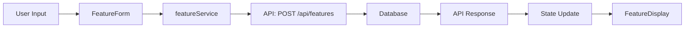

# NEW_FEATURE Mode

## When to Use

Use this mode when **adding functionality to an existing project**. The user wants to add, implement, or create something within an existing codebase.

**Example inputs:**
- "Add dark mode to the app"
- "Implement payment integration"
- "Create a user profile page"
- "Add export to PDF functionality"

**Detection signals:**
- "add", "implement", "create" within existing codebase
- Adding functionality to existing project
- Feature enhancement request
- Existing codebase context

## Output Structure

```
{output_base}/planning/{project-name}/
├── README.md
├── discovery/
│   └── CONVENTIONS.md              # Existing patterns and conventions
├── analysis/
│   └── ANALYSIS.md
├── planning/
│   └── PLANNING.md
├── execution/
│   └── EXECUTION.md
└── sprints/
    ├── PROGRESS.md
    └── SPRINT-{N}-{name}.md
```

**Documents that are NOT generated:**
- `requirements/` - Not applicable (feature-level, not project-level)
- `design/` - Not applicable (unless architecture changes, then use ARCHITECTURE mode)

## Frontmatter Additions

No mode-specific frontmatter fields for NEW_FEATURE. All documents use the standard universal schema.

## Workflow

**NEW_FEATURE Workflow:** Discovery → Analysis → Planning → Execution → Sprints → Handoff

### Step 1: Codebase Discovery

**CRITICAL:** Before planning any feature, explore the existing codebase to understand patterns, architecture, and conventions.

Generate `discovery/CONVENTIONS.md` documenting:
- Project structure and module organization
- Coding patterns and conventions
- State management approach
- Component/module architecture
- API and data flow patterns
- Testing approach
- Existing similar features (reference implementations)

### Step 2: Analysis

**Analysis adapts to:**
- **Feature Architecture:** Component breakdown, module structure
- **Integration Points:** Which existing modules this feature touches
- **Data Flow:** How data flows through the feature (inputs, transforms, outputs)
- **Interface Definitions:** APIs, props, events, contracts
- **Dependencies:** External libraries, existing utilities, shared components
- **Side Effects:** What existing functionality might be affected

**Key questions to answer:**
- What existing components can be reused?
- What new components/modules need to be created?
- What existing APIs/services need to be extended?
- What data models need to be created/modified?
- What tests need to be added/updated?

### Step 3-5: Planning, Execution, Sprints

Follow the shared workflow steps.

## Recommended Sprint Structure

Organize sprints by technical layers:

| Sprint | Focus | Deliverables |
|--------|-------|--------------|
| **Sprint 1: Setup** | Scaffolding, models, interfaces | Data models, API contracts, types/interfaces |
| **Sprint 2: Core** | Business logic, services | Service layer, state management, core logic |
| **Sprint 3: UI/Integration** | Components, views, integration | UI components, views, integration with existing code |
| **Sprint 4: Testing** | Unit tests, e2e tests, polish | Test coverage, bug fixes, documentation, polish |

Adjust sprint count based on feature complexity:
- **Simple feature** (1-3 days): 1 sprint (all-in-one)
- **Medium feature** (1-2 weeks): 2 sprints (Core + UI/Testing)
- **Complex feature** (2-4 weeks): 3-4 sprints (as above)

## Analysis Focus Areas

### Feature Architecture

```markdown
## Feature Architecture

### Components
- **FeatureContainer** - Main container component
- **FeatureForm** - Form handling
- **FeatureDisplay** - Display component

### Services
- **featureService.ts** - API calls and business logic

### State Management
- **featureSlice.ts** - Redux slice (or useFeatureStore hook)

### Types
- **feature.types.ts** - TypeScript interfaces
```

### Integration Points

```markdown
## Integration Points

### Existing Modules
- **AuthModule** - Uses authentication context
- **NavigationModule** - Adds new route `/feature`
- **DataModule** - Reads from shared data store

### API Endpoints
- **POST /api/features** - Create feature
- **GET /api/features/:id** - Get feature
- **PUT /api/features/:id** - Update feature
```

### Data Flow



## Examples

**Example 1: Add dark mode**
- Sprints: 2 (Core + UI)
- Integration: Theme provider, all components
- New modules: `theme.service.ts`, `ThemeSwitcher.tsx`
- Modified: Every component that uses colors

**Example 2: Payment integration**
- Sprints: 3 (Setup + Core + Testing)
- Integration: Checkout flow, user profile, admin panel
- New modules: `payment.service.ts`, `PaymentForm.tsx`, `payment.types.ts`
- External: Stripe SDK

**Example 3: Export to PDF**
- Sprints: 2 (Core + UI)
- Integration: Report module
- New modules: `pdf.service.ts`, `ExportButton.tsx`
- External: jsPDF library
