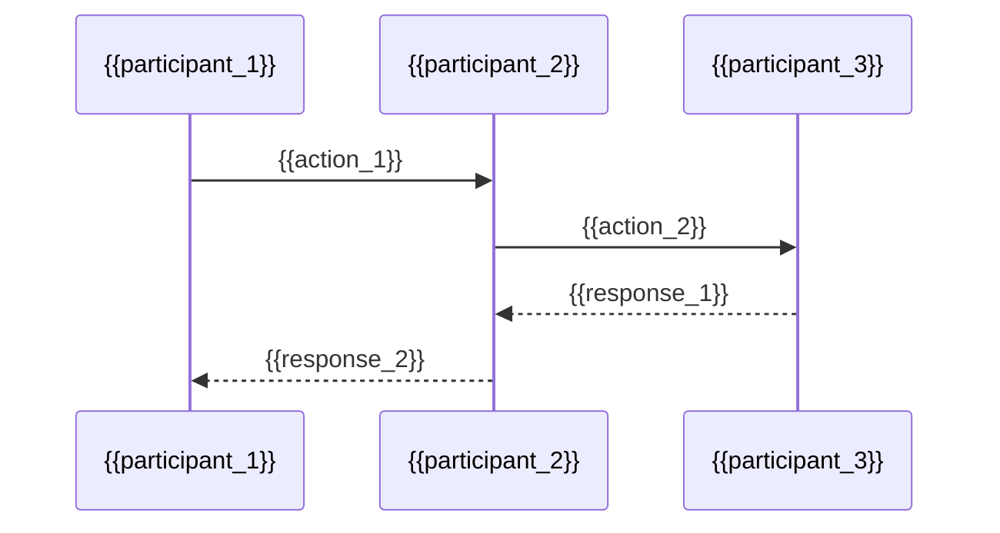

# Codebase Conventions: {{project_name}}

**Date Discovered:** {{date}}
**Scope:** {{scope}}
**Purpose:** Document existing patterns, conventions, and architecture to inform planning decisions

---

## Project Structure

### Directory Layout

```
{{project_root}}/
├── {{dir_1}}/          # {{dir_1_purpose}}
├── {{dir_2}}/          # {{dir_2_purpose}}
├── {{dir_3}}/          # {{dir_3_purpose}}
└── {{dir_4}}/          # {{dir_4_purpose}}
```

**Key Observations:**
- {{observation_1}}
- {{observation_2}}
- {{observation_3}}

### Module Organization
- **Module Type 1:** {{module_type_1_description}}
- **Module Type 2:** {{module_type_2_description}}
- **Module Type 3:** {{module_type_3_description}}

---

## Architecture

### System Overview

```mermaid
graph TD
    A[{{component_A}}] --> B[{{component_B}}]
    B --> C[{{component_C}}]
    C --> D[{{component_D}}]
```

**Description:** [High-level architecture description]

### Key Components

#### {{component_1_name}}
**Location:** `{{component_1_path}}`

**Purpose:** {{component_1_purpose}}

**Dependencies:**
- Depends on: {{depends_on}}
- Used by: {{used_by}}

#### {{component_2_name}}
**Location:** `{{component_2_path}}`

**Purpose:** {{component_2_purpose}}

**Dependencies:**
- Depends on: {{depends_on}}
- Used by: {{used_by}}

---

## Coding Patterns

### Naming Conventions

| Type | Convention | Example |
|------|-----------|---------|
| Files | {{file_convention}} | `{{file_example}}` |
| Classes | {{class_convention}} | `{{class_example}}` |
| Functions | {{function_convention}} | `{{function_example}}` |
| Variables | {{variable_convention}} | `{{variable_example}}` |
| Constants | {{constant_convention}} | `{{constant_example}}` |

### Code Style
- **Indentation:** {{indentation}}
- **Quotes:** {{quote_style}}
- **Semicolons:** {{semicolon_usage}}
- **Line length:** {{line_length}}
- **Linter:** {{linter}} (config: `{{linter_config}}`)

---

## Technology Stack

### Languages & Frameworks

| Layer | Technology | Version | Notes |
|-------|-----------|---------|-------|
| Frontend | {{frontend_tech}} | {{frontend_version}} | {{frontend_notes}} |
| Backend | {{backend_tech}} | {{backend_version}} | {{backend_notes}} |
| Database | {{database_tech}} | {{database_version}} | {{database_notes}} |
| Infrastructure | {{infra_tech}} | {{infra_version}} | {{infra_notes}} |

### Key Libraries

**{{category_1}}:**
- `{{library_1}}` - {{library_1_purpose}}
- `{{library_2}}` - {{library_2_purpose}}

**{{category_2}}:**
- `{{library_3}}` - {{library_3_purpose}}
- `{{library_4}}` - {{library_4_purpose}}

---

## Data Management

### State Management
**Pattern:** {{state_pattern}}

**Location:** `{{state_location}}`

**Key Patterns:**
- {{state_pattern_1}}
- {{state_pattern_2}}

### Data Flow



### Database Schema

**Tables/Collections:**
- `{{table_1}}` - {{table_1_purpose}}
- `{{table_2}}` - {{table_2_purpose}}
- `{{table_3}}` - {{table_3_purpose}}

**Relationships:**
- {{relationship_1}}
- {{relationship_2}}

---

## API & Integration

### API Patterns
**Style:** {{api_style}} (REST/GraphQL/gRPC)

**Base URL:** `{{api_base_url}}`

**Authentication:** {{auth_method}}

**Example Endpoints:**
```
GET    {{endpoint_1}}    # {{endpoint_1_purpose}}
POST   {{endpoint_2}}    # {{endpoint_2_purpose}}
PUT    {{endpoint_3}}    # {{endpoint_3_purpose}}
DELETE {{endpoint_4}}    # {{endpoint_4_purpose}}
```

### Error Handling
**Pattern:** {{error_pattern}}

**Example:**
```{{language}}
{{error_handling_example}}
```

---

## Testing

### Test Structure

```
{{test_directory}}/
├── unit/           # {{unit_test_location}}
├── integration/    # {{integration_test_location}}
└── e2e/           # {{e2e_test_location}}
```

### Testing Patterns
- **Unit Tests:** {{unit_test_pattern}}
- **Integration Tests:** {{integration_test_pattern}}
- **E2E Tests:** {{e2e_test_pattern}}

### Coverage
- **Current Coverage:** {{current_coverage}}%
- **Target Coverage:** {{target_coverage}}%
- **Tool:** {{coverage_tool}}

---

## Build & Deploy

### Build System
**Tool:** {{build_tool}}

**Key Scripts:**
```bash
{{build_command}}        # Build for production
{{dev_command}}          # Run development server
{{test_command}}         # Run tests
{{lint_command}}         # Run linter
```

### Deployment
**Environment:** {{deployment_env}}

**Process:** {{deployment_process}}

**CI/CD:** {{cicd_tool}}

---

## Configuration

### Environment Variables
**File:** `{{env_file}}`

**Key Variables:**
- `{{env_var_1}}` - {{env_var_1_purpose}}
- `{{env_var_2}}` - {{env_var_2_purpose}}
- `{{env_var_3}}` - {{env_var_3_purpose}}

### Feature Flags (if applicable)
- `{{flag_1}}` - {{flag_1_purpose}} ({{flag_1_status}})
- `{{flag_2}}` - {{flag_2_purpose}} ({{flag_2_status}})

---

## Similar Features (Reference Implementations)

### {{similar_feature_1}}
**Location:** `{{feature_1_location}}`

**Pattern Used:** {{feature_1_pattern}}

**Lessons:** {{feature_1_lessons}}

### {{similar_feature_2}}
**Location:** `{{feature_2_location}}`

**Pattern Used:** {{feature_2_pattern}}

**Lessons:** {{feature_2_lessons}}

---

## Pain Points & Technical Debt

### Current Issues
1. **{{issue_1}}:** {{issue_1_description}}
2. **{{issue_2}}:** {{issue_2_description}}
3. **{{issue_3}}:** {{issue_3_description}}

### Areas to Avoid
- ⚠️ **{{antipattern_1}}** - {{why_avoid_1}}
- ⚠️ **{{antipattern_2}}** - {{why_avoid_2}}

---

## Recommended Patterns

### ✅ Do This
1. **{{recommended_pattern_1}}** - {{pattern_1_rationale}}
2. **{{recommended_pattern_2}}** - {{pattern_2_rationale}}
3. **{{recommended_pattern_3}}** - {{pattern_3_rationale}}

### ❌ Don't Do This
1. **{{antipattern_1}}** - {{antipattern_1_reason}}
2. **{{antipattern_2}}** - {{antipattern_2_reason}}

---

## Documentation

### Where to Find Docs
- **API Docs:** {{api_docs_location}}
- **Component Docs:** {{component_docs_location}}
- **Setup Guide:** {{setup_guide_location}}

### Documentation Style
{{documentation_style_description}}

---

## Referencias

**Parent Documents:**
- [[README]]

**Sibling Documents:**
- [[ANALYSIS]]

**Related:**
- Architecture diagrams (if external)
- Technical specifications (if external)
