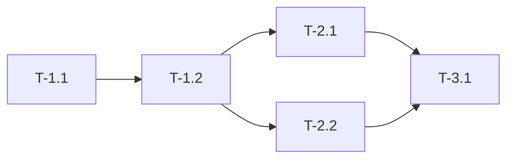

# Execution Plan: {{project_name}}

**Mode:** {{mode}}
**Date:** {{date}}
**Estimated Duration:** {{duration}}

---

## Overview

### What We're Building
[Clear, concise description of the deliverable]

### How We'll Build It
[High-level approach to implementation]

### When It's Done
[Definition of done - concrete, verifiable criteria]

---

## Task Breakdown

### Phase 1: {{phase_1_name}}

#### Task 1.1: {{task_1_1_name}}

**ID:** T-1.1

**Description:** {{task_1_1_description}}

**Acceptance Criteria:**
- [ ] {{criterion_1}}
- [ ] {{criterion_2}}
- [ ] {{criterion_3}}

**Dependencies:**
- Depends on: {{dependencies}}
- Blocks: {{blocks}}

**Estimated Effort:** {{effort_estimate}}

**Verification:**
```bash
{{verification_command}}
```

**Files:**
- `{{file_path_1}}` ({{action: create|modify|delete}})
- `{{file_path_2}}` ({{action}})

**Before (Current State):**
```{{language}}
// Code at {{file_path}}:L{{start}}-L{{end}}
{{current_code}}
```

**After (Target State):**
```{{language}}
{{target_code}}
```

*Use "N/A" for Before when creating new files, or for After when deleting files.*

**Rollback:**
```bash
{{rollback_command}}
```

---

#### Task 1.2: {{task_1_2_name}}

**ID:** T-1.2

**Description:** {{task_1_2_description}}

**Acceptance Criteria:**
- [ ] {{criterion_1}}
- [ ] {{criterion_2}}

**Dependencies:**
- Depends on: T-1.1
- Blocks: {{blocks}}

**Estimated Effort:** {{effort_estimate}}

**Verification:**
```bash
{{verification_command}}
```

**Rollback:**
```bash
{{rollback_command}}
```

---

### Phase 2: {{phase_2_name}}

#### Task 2.1: {{task_2_1_name}}

**ID:** T-2.1

**Description:** {{task_2_1_description}}

**Acceptance Criteria:**
- [ ] {{criterion_1}}
- [ ] {{criterion_2}}

**Dependencies:**
- Depends on: T-1.2
- Blocks: {{blocks}}

**Estimated Effort:** {{effort_estimate}}

**Verification:**
```bash
{{verification_command}}
```

**Rollback:**
```bash
{{rollback_command}}
```

---

## Task Granularity Levels

Tasks follow a 4-level granularity system:

| Level | Description | Effort | Example |
|-------|-------------|--------|---------|
| **L1 - Sprint** | Major milestone | 3-7 days | "Implement user authentication" |
| **L2 - Phase** | Logical grouping | 0.5-2 days | "Add login form with validation" |
| **L3 - Task** | Discrete work item | 1-4 hours | "Create LoginForm component" |
| **L4 - Subtask** | Single action | 5-30 min | "Add email validation to form" |

**This execution plan uses L3 (Task) granularity by default.**

---

## Dependencies Map



**Critical Path:** T-1.1 → T-1.2 → T-2.1 → T-3.1

**Parallelizable Tasks:**
- T-2.1 and T-2.2 can run in parallel after T-1.2

---

## Implementation Details

### Architecture Changes

**New Components:**
- {{component_1}} - {{component_1_purpose}}
- {{component_2}} - {{component_2_purpose}}

**Modified Components:**
- {{modified_component_1}} - {{modification_description}}

**Deleted Components:**
- {{deleted_component}} - {{deletion_reason}}

### Data Model Changes

**New Tables/Collections:**
```sql
{{table_schema}}
```

**Modified Tables:**
- `{{table_name}}`: Added columns: {{columns}}

### API Changes

**New Endpoints:**
```
POST   {{new_endpoint_1}}    # {{purpose_1}}
GET    {{new_endpoint_2}}    # {{purpose_2}}
```

**Modified Endpoints:**
- `{{modified_endpoint}}`: {{change_description}}

---

## Testing Strategy

### Unit Tests

**Coverage Target:** {{unit_test_coverage}}%

**Key Test Cases:**
1. {{test_case_1}}
2. {{test_case_2}}
3. {{test_case_3}}

### Integration Tests

**Scenarios:**
1. {{integration_scenario_1}}
2. {{integration_scenario_2}}

### E2E Tests

**User Flows:**
1. {{e2e_flow_1}}
2. {{e2e_flow_2}}

---

## Deployment Plan

### Pre-Deployment Checklist
- [ ] All tests passing (unit, integration, e2e)
- [ ] Code reviewed and approved
- [ ] Documentation updated
- [ ] Database migrations prepared
- [ ] Feature flags configured
- [ ] Rollback plan documented

### Deployment Steps

**Step 1: Database Migration**
```bash
{{migration_command}}
```

**Step 2: Deploy Backend**
```bash
{{backend_deploy_command}}
```

**Step 3: Deploy Frontend**
```bash
{{frontend_deploy_command}}
```

**Step 4: Verification**
```bash
{{verification_command}}
```

### Rollback Plan

**If deployment fails:**
1. {{rollback_step_1}}
2. {{rollback_step_2}}
3. {{rollback_step_3}}

**Rollback Command:**
```bash
{{rollback_command}}
```

---

## Risk Mitigation

### Technical Risks

| Risk | Mitigation | Owner |
|------|------------|-------|
| {{risk_1}} | {{mitigation_1}} | {{owner_1}} |
| {{risk_2}} | {{mitigation_2}} | {{owner_2}} |

### Operational Risks

| Risk | Mitigation | Owner |
|------|------------|-------|
| {{op_risk_1}} | {{mitigation_1}} | {{owner_1}} |
| {{op_risk_2}} | {{mitigation_2}} | {{owner_2}} |

---

## Quality Gates

### Code Quality
- [ ] Lint passes (0 errors, 0 warnings)
- [ ] Code coverage >= {{coverage_target}}%
- [ ] No security vulnerabilities (high/critical)
- [ ] Performance benchmarks met

### Review Gates
- [ ] Code reviewed by {{reviewer_1}}
- [ ] Architecture reviewed by {{reviewer_2}}
- [ ] Security reviewed (if applicable)

### Testing Gates
- [ ] All unit tests passing
- [ ] All integration tests passing
- [ ] All e2e tests passing
- [ ] Manual QA completed

---

## Monitoring & Observability

### Metrics to Track
- {{metric_1}}: {{description_1}}
- {{metric_2}}: {{description_2}}
- {{metric_3}}: {{description_3}}

### Alerts to Configure
- {{alert_1}}: Threshold {{threshold_1}}
- {{alert_2}}: Threshold {{threshold_2}}

### Logs to Monitor
- {{log_source_1}}: {{what_to_watch_1}}
- {{log_source_2}}: {{what_to_watch_2}}

---

## Success Criteria

### Technical Success
- [ ] All features implemented per spec
- [ ] No P0/P1 bugs
- [ ] Performance meets SLAs
- [ ] Security scan clean

### Business Success
- [ ] {{business_criterion_1}}
- [ ] {{business_criterion_2}}
- [ ] {{business_criterion_3}}

---

## Sprint Assignment

Tasks are distributed across sprints in [[PROGRESS]]:

| Sprint | Tasks | Focus |
|--------|-------|-------|
| [[SPRINT-1]] | T-1.1, T-1.2 | {{sprint_1_focus}} |
| [[SPRINT-2]] | T-2.1, T-2.2 | {{sprint_2_focus}} |
| [[SPRINT-3]] | T-3.1, T-3.2 | {{sprint_3_focus}} |

---

## Section Applicability

*Omit sections marked "No" entirely for the given sub-mode. Sections marked "Optional" may be included if relevant.*

| Section | NEW_PROJECT | NEW_FEATURE | REFACTOR | BUG_FIX | TECH_DEBT | ARCHITECTURE |
|---------|:-----------:|:-----------:|:--------:|:-------:|:---------:|:------------:|
| Deployment Plan | Yes | Optional | Optional | Optional | No | Yes |
| Monitoring & Observability | Yes | Optional | No | No | No | Yes |
| Data Model Changes | Yes | Optional | Optional | No | No | Yes |
| API Changes | Yes | Optional | Optional | No | No | Yes |
| Budget | Yes | No | No | No | No | Yes |

---

## References

**Parent Documents:**
- [[README]]
- [[PLANNING]]

**Sibling Documents:**
- [[ANALYSIS]]
- [[CONVENTIONS]]

**Child Documents:**
- [[PROGRESS]]
- [[SPRINT-1]]
- [[SPRINT-2]]
- [[SPRINT-3]]

---

## Template Notes

**Task Naming:** Use descriptive, action-oriented names (e.g., "Create LoginForm component", not "LoginForm")

**IDs:** Use T-{phase}.{task} format (e.g., T-1.1, T-2.3)

**Verification Commands:** Provide executable commands to verify task completion

**Rollback Commands:** Provide commands to undo changes if needed

**Dependencies:** Always document what blocks and what is blocked by each task
